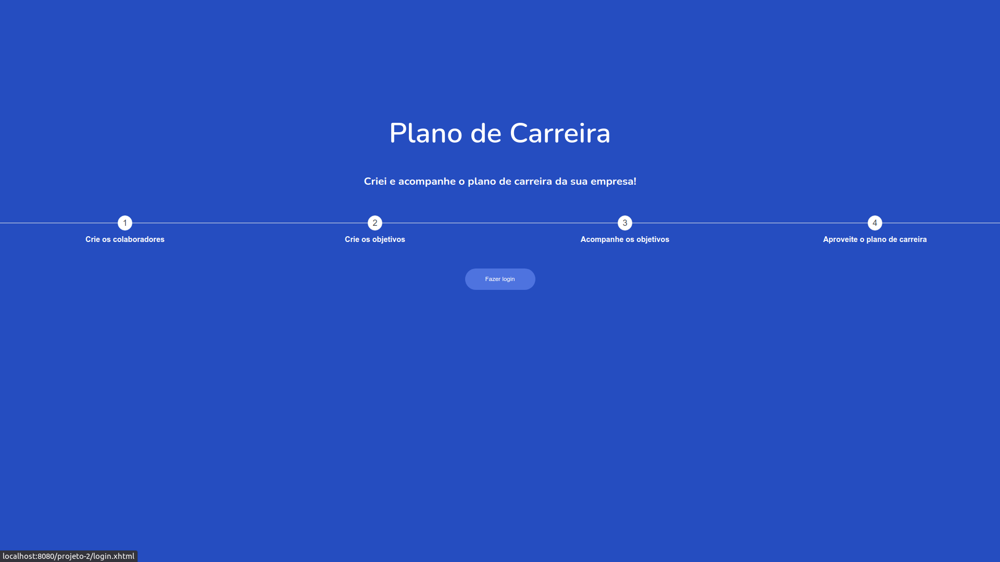
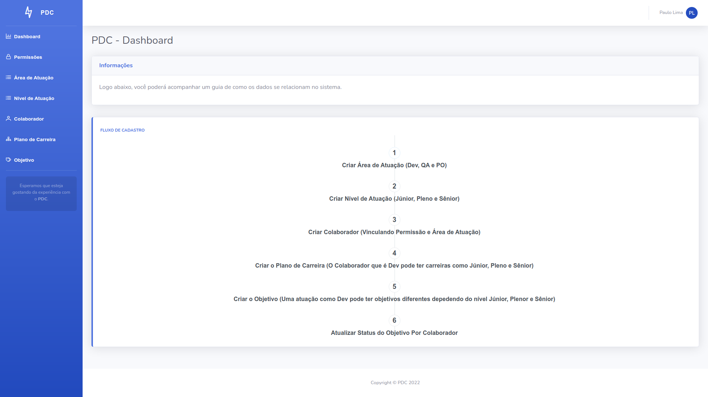

# PDC - Gerenciamento de Plano de Carreira

## Organize o plano de carreira da sua empresa!

> Com o PDC você pode manipular o plano de carreira da sua empresa, criando variadas áreas de atuação, com variadis níveis de atuação, e mais, podendo definir uma lista de objetos para controlar tudo o que você precisa na hora de acomapanhar a evolução do seu profissional. O que acha?! 😄

> Preview do Painel, logo acima.

## Quais recursos extras o PDC utiliza?

- API pública do UI Avatars: https://ui-avatars.com/api/;
  - Utilizada para gerar avatares dinâmicos de acordo com o nome do usuário.
- Template bootstrap: https://startbootstrap.com/theme/sb-admin-2;

## O que o PDC necessita para rodar?

Além de possuir a configuração local instalada com Eclipse, Apache Tomcat e Java, você precisará do MySQL para criar a estrutura inicial do banco de dados, o script de criação do banco e das tabelas necessárias pode ser encontrado [aqui](script-mysql/script-mysql.sql).

São criados as duas permissões necessárias do sistema *ADMIN* e *EMPLOYEE*, além de um usuário inicial para dar início a plotagem de dados no sistema.

## Apresentação

Assista a apresentação do projeto [aqui](https://drive.google.com/file/d/1rWj0ccKKaFSVImfkhZLsuv6ZgEZgthIP/view?usp=sharing).

## 🤝 Colaboradores

<table>
  <tr>
    <td align="center">
      <a href="#">
         
        
          <b>Paulo de Lima Xavier </b>
        
         
        
          <b>20190104147</b>
        
      </a>
    </td>
  </tr>
</table>

#### Obrigado por chegar até aqui! ❤️  

[⬆ Voltar ao topo](#YouSong) 